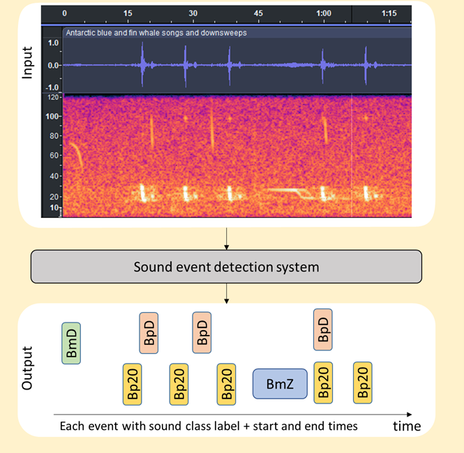

# Supervised detection of strongly-labelled Antarctic blue and fin whale calls (DCASE 2025 Task 2) source code

## Scientific context

Antarctic blue (*Balaenoptera musculus intermedia*) and fin (*Balaenoptera physalus quoyi*) whales were nearly wiped out
during industrial whaling. For the past twenty-five years, long-term passive acoustic monitoring has provided one of the
few cost-effective means of studying them on their remote feeding grounds at high latitudes around the Antarctic
continent.
Long term acoustic monitoring efforts have been conducted by several nations in the Antarctic, and in recent years this
work has been coordinated internationally via the Acoustic Trends Working Group of the Southern Ocean Research
Partnership of the International Whaling Commission (IWC-SORP). Some of the overarching goals of the Acoustic Trends
Project include “using acoustics to examine trends in Antarctic blue and fin whale population growth, abundance,
distribution, seasonal movements, and behaviour” [1].

Within the IWC-SORP Acoustic Trends Project relevant ecological metrics include presence of acoustic calls over time
scales ranging from minutes to months. Furthermore, recent work has highlighted additional value that can be derived
from estimates of the number of calls per time-period [2].

In 2020, the Acoustic Trends Project released publicly one of the largest annotated datasets for marine bioacoustics,
the so-called AcousticTrends_BlueFinLibrary (ATBFL) [3]. Release of this annotated library was intended to help
standardise analysis and compare the performance of different detectors across the range of locations, years, and
instruments used to monitor these species.

[1] Miller et al. 2021. An open access dataset for developing automated detectors of Antarctic baleen whale sounds and
performance evaluation of two commonly used detectors, Sci. Rep., 11, 806. doi:10.1038/s41598-020-78995-8
[2] Castro et al (2024). Beyond counting calls: estimating detection probability for Antarctic blue whales reveals
biological trends in seasonal calling. Front. Mar. Sci. doi:10.3389/fmars.2024.1406678
[3] Miller et al. (2020). An annotated library of underwater acoustic recordings for testing and training automated
algorithms for detecting Antarctic blue and fin whale sounds. doi: 10.26179/5e6056035c01b

## Definition
Our task is a classical supervised multi-class sound event detection task with strong labeling. The target of the
systems is to provide not only the event class but also the event time localization given that multiple events can be
present in an audio recording (see Fig 1).

In the context of the IWC-SORP Acoustic Trends Project described above, this task is applied to the detection of 6
different call types from two different species, namely blue whales and fin whales. This task aims to challenge and
assess the ability of models to adapt and perform in varying acoustic environments, reflecting the real-world
variability encountered in marine mammal monitoring.

Figure 1: Overview of the sound event detection task. Blue whale (Bm) D and Z calls are present as well as fin whale (
Bp) 20 Hz calls.

## Emblematic user scenario
Although this model benchmark will develop within a specific research program described above, it also aims to answer
more generic user needs / questions as illustrated in this short user story :
“I have developed a detection model showing a very good precision-recall (score) on my study site and my target whale
species, recorded during last winter. And now, I would like to implement it onboard a mobile platform to monitor the
same species year-round over a wider spatial area. Doing so, I will NOT have access to the new recorded data at all!
Questions : will my model be able to keep the same level of performance ? Is my model choice reasonable or should I
transition to another one ? ”

## Model development

### Development corpus

Our development corpus is composed of all IWC-SORP ATBFL datasets organized in site-year pairs, as described in Table 1.
It includes 1762 hours of audio recordings.

| Site-year            |BmA  | BmB | BmZ | BmD | Bp20Hz | Bp20Plus | BpDS | Total duration (h) | Ratio total detections / hour (%)|
| -------------------- | ------ | ----- | ----- | ------ | ------ | ----- | ----- | ---- | ----- |
| Maud Rise 2014       | 2188   | 37    | 28    | 70     | 23     | 5     | 6     | 83.3 | 28.5  |
| Greenwich 2015       | 827    | 157   | 29    | 66     | 2      | 1     | 46    | 31.7 | 35.6  |
| Kerguelen 2005       | 812    | 237   | 166   | 435    | 788    | 78    | 444   | 200  | 14.8  |
| Kerguelen 2014       | 2,557  | 1,177 | 563   | 435    | 1,920  | 1,826 | 344   | 200  | 44.1  |
| Kerguelen 2015       | 1,970  | 542   | 236   | 1,180  | 552    | 718   | 344   | 200  | 17.9  |
| Casey 2014           | 3,681  | 1,398 | 1,091 | 679    | 17     | 0     | 0     | 194  | 35.4  |
| Casey 2017           | 1,741  | 558   | 119   | 553    | 78     | 214   | 0     | 185  | 17.6  |
| Ross Sea 2014        | 104    | 0     | 0     | 0      | 0      | 0     | 0     | 176  | 0.6   |
| Balleny Islands 2015 | 923    | 44    | 31    | 47     | 951    | 148   | 78    | 204  | 10.9  |
| Elephant Island 2013 | 2625   | 1,786 | 152   | 299    | 3,662  | 1,859 | 1042  | 187  | 110.6 |
| Elephant Island 2014 | 6,935  | 967   | 100   | 1,034  | 4,940  | 2,912 | 3660  | 216  | 97.1  |
| Total                | 24,189 | 6,791 | 2,506 | 15,100 | 12,539 | 7,503 | 6,306 | 1762 |       |
Table 1 : Summary statistics on the development datasets.

### Train and validation partition
TO BE CONFIRMED

### Download
Raw audio recordings of the development corpus, along with annotation data, can be downloaded from this zenodo entry:
XXXXX 

These data have been reformatted to fit the challenge formatting. 

### Supplementary resources

## Model evaluation
A complete code is provided to run the evaluation metrics (see evaluation folder)

### Dataset

### Download
This dataset will only be released on the 1st June 2025.

# Annotation
Our development annotation set corresponds to the one published within the ATBFL corpus of datasets described above,
where each site-year dataset gets its own annotation file. It has already been exploited in several benchmarking
research papers (e.g. Miller2021, Schall2024). Minor changes were brought to this original annotation set such as adopting
more consistent naming conventions, pooling together all files per call type into a single file per dataset etc (see the
complete list of minor changes on the Zenodo webpage).

For what concerns the overall quality of this annotation set, we can first mention that it was annotated by
bioacoustician experts according to the SORP annotation guideline available here. Despite such precautions, already far
from common practices in our community, we are aware that this annotation setup has some limitations, which might have
induced defects that any model developer based on this dataset should be aware of. We review such limitations and
provide feedback here, trying to be as transparent as possible.

Having said that, it is widely recognized that having high quality annotations on such a large scale dataset is a very
complex process, both in terms of human resources and scientific expertise. As recognized in related audio processing
fields (for example, in Fonseca2022), these potential defects in the annotations of our development set should be more
seen as an intrinsic component of our data challenge reflecting real-life annotation practices that should be fully
addressed by models.

# Format
https://pam-challenge-beta.github.io/website/datasets/#annotation-format

# Rules and submission

Participants are free to employ any preprocessing technique and network architecture. The only requirement is that the
final output of your model MUST be a CSV file formatted following the annotation format of evaluation set described
above.
Official challenge submission consists of:
System output file (*.csv)
Metadata file (*.yaml)
Technical report explaining in sufficient detail the method (*.pdf)
System output should be presented as a single text-file (in CSV format, with a header row as shown in the example output
below).

## Baseline
The code to reproduce the baselines can be found on the baselines folder

## Getting started
We have prepared a sample code to serve as an example and to provide general guidance for approaching this task. This
approach is intended solely as a reference, and you are not required to follow any specific steps outlined in it, except
for running the metrics file. Nonetheless, this serves as a useful guideline for participating in the challenge.
